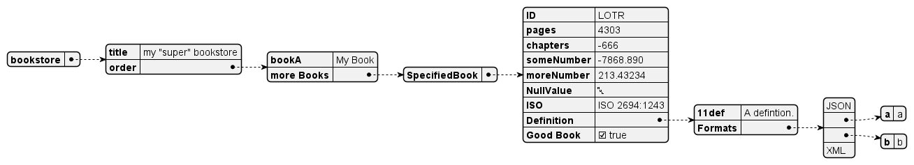

<!-- (c) https://github.com/MontiCore/monticore -->

<!-- This is a MontiCore stable explanation. -->

# JSON Language Description

* The MontiCore language JSON contains the grammar
  and symbol management infrastructure for parsing and processing
  JSON artifacts

```json
    {
  "Alice": {
    "fullname": "Alice Anderson",
    "address": {
      "postal_code": 10459,
      "street": "Beck Street",
      "number": 56
    }
  },
  "Bob": {
    "fullname": "Bob Barkley",
    "address": {
      "postal_code": 10459,
      "street": "Freeman Street",
      "number": 73
    }
  }
}
```

* The main purpose of this language is parsing general artifacts in JSON format
  that adhere to the common
  [standard](http://www.ecma-international.org/publications/files/ECMA-ST/ECMA-404.pdf).
* The JSON grammar adheres to the common **standard** and allows parsing
  arbitrary JSON artifacts for further processing.
* Actually the grammar represents a slight superset to the official JSON standard.
  It is intended for parsing JSON-compliant artifacts. Further well-formedness
  checks are not included, because we assume to parse correctly produced JSON
  documents only.
* Please note that JSON (like XML or ASCII) is just a carrier language.
  The conrete JSON dialect and the question, how to recreate the
  real objects / data structures, etc. behind the JSON tree structure
  is beyond this grammar, but can be applied to the AST defined here.
* Main grammar [`de.monticore.lang.JSON.mc4`](src/main/grammars/de/monticore/lang/JSON.mc4).

## Symboltable

* The JSON artifacts do not provide any symbols.

### Symbol kinds used by JSON (importable):

* None, because JSON does not have mechanisms to refer to external symbols.

### Symbols exported by JSON:

* JSON documents generally do NOT export any symbol to external artifacts.
  This has two reasons:
    * Usually JSON dialect encode their information in various
      specific forms. A default symbol table would therefore
      not be useful.
    * JSON is mainly a transport technique for data, e.g. during runtime
      of products, services, but also tools and simulators. JSON artefacts
      are meant for reading and processing, not usually for referring to
      their internal information by other artifacts.
* Thus there is no symbol-table to be stored.

## Functionality: CoCos

* none provided; it is assumed that the JSON model was produced correctly.

## Handwritten Extensions

* [JSONTool](./src/main/java/de/monticore/JSONTool.java)
  A command line interface for the JSON language.
* [JSONToPlantUML](./src/main/java/de/monticore/lang/json/prettyprint/JSONToPlantUML.java)
  A pretty printer translating JSON documents to PlantUML DSL code.
* [PlantUMLConfig](./src/main/java/de/monticore/lang/json/prettyprint/PlantUMLConfig.java)
  A config class providing styling options for PlantUML pretty printing.
* [PlantUMLUtil](./src/main/java/de/monticore/lang/json/prettyprint/PlantUMLUtil.java)
  A utility class providing methods to load JSON documents and to translate the to PlantUML DSL code or to render them
  as PlantUML JSON diagrams in SVG format.
* [FullPropertyCalculator](./src/main/java/de/monticore/lang/json/_visitor/FullPropertyCalculator.java)
  A visitor that extracts all property names (as list and counted set) from the
  JSON artifact.
* [TopLevelPropertyCalculator](./src/main/java/de/monticore/lang/json/_visitor/TopLevelPropertyCalculator.java)
  A visitor that extracts the top-level property names from the JSON artifact.

## Usage

### Command Line Interface

* The JSONTool provides a general interface for the functionalities developed for
  the JSON language. This includes all features such as parsing of models,
  pretty printing, reporting, or export as object diagram.
* By default, we provide a JAR `MCJSON.jar` that can be used via the command
  `java -jar MCJSON.jar <parameters>`
* Present Options are:

| Option                                                                                                   | Explanation                                                                                                                                                                                                                                                                                                       |
|----------------------------------------------------------------------------------------------------------|-------------------------------------------------------------------------------------------------------------------------------------------------------------------------------------------------------------------------------------------------------------------------------------------------------------------|
| `-h,--help`                                                                                              | Prints this help dialog.                                                                                                                                                                                                                                                                                          |
| `-i,--input <file>`                                                                                      | Reads the source file (mandatory) and parses the contents as JSON.                                                                                                                                                                                                                                                |
| `-pp,--prettyprint (json [<file>] \| puml (plain \| styled) (txt [<file>] \| svg <file> \| png <file>))` | Prints the JSON either as pretty printed JSON (json), PlantUML DSL code (puml txt), or PlantUML SVG/PNG diagram (puml svg\|png), and writes it to the given file (mandatory for SVG/PNG). When using PlantUML it must be specified whether to use default styling (plain) or the "Darkula"-themed style (styled). |
| `-r,--report <dir>`                                                                                      | Prints reports of the JSON artifact to the specified directory (optional). Available reports: allProperties.txt: a list of all properties, countedProperties.txt: a set of all properties with the number of occurrences, topLevelProperties.txt: a list of all top level properties.                             |
| `-so,--syntaxobjects <file>`                                                                             | Prints an object diagram of the JSON-AST to stdout or the specified file (optional).                                                                                                                                                                                                                              |

### Examples

Loads the JSON document from `bookstore.json` and pretty-prints it as PlantUML DSL string to the console including code
for the "Darkula"-themed style:

```
MCJSON.jar -i "./bookstore.json" -pp puml styled txt
```

Output:

```
@startjson
<style>
jsonDiagram {
  node {
    BackGroundColor #2b2b2b
    RoundCorner 0
  }
}
</style>
{
  "<color:#8872b0>bookstore": {
    "<color:#8872b0>title": "<color:#688153>my \"super\" bookstore",
    "<color:#8872b0>order": {
      "<color:#8872b0>bookA": "<color:#688153>My Book",
      "<color:#8872b0>more Books": {
        "<color:#8872b0>SpecifiedBook": {
          "<color:#8872b0>ID": "<color:#688153>LOTR",
          "<color:#8872b0>pages": "<color:#6798c1>4303",
          "<color:#8872b0>chapters": "<color:#6798c1>-666",
          "<color:#8872b0>someNumber": "<color:#6798c1>-7868.890",
          "<color:#8872b0>moreNumber": "<color:#6798c1>213.43234",
          "<color:#8872b0>NullValue": "<color:#6798c1>null",
          "<color:#8872b0>ISO": "<color:#688153>ISO 2694:1243",
          "<color:#8872b0>Definition": {
            "<color:#8872b0>11def": "<color:#688153>A defintion.",
            "<color:#8872b0>Formats": [
              "<color:#688153>JSON",
              {
                "<color:#8872b0>a": "<color:#688153>a"
              },
              {
                "<color:#8872b0>b": "<color:#688153>b"
              },
              "<color:#688153>XML"
            ]
          },
          "<color:#8872b0>Good Book": "<color:#cb742f>true"
        }
      }
    }
  }
}
@endjson
```

Loads the JSON document from `bookstore.json`, renders a corresponding PlantUML image in PNG format using plain PlantUML
styling, and saves it to `bookstore.png`:

```
MCJSON.jar -i "./bookstore.json" -pp puml plain png "./bookstore.png"
```

Output:



Loads the JSON document from `bookstore.json`, renders a corresponding PlantUML image in SVG format using
"Darkula"-themed PlantUML styling, and saves it to `bookstore.svg`:

```
MCJSON.jar -i "./bookstore.json" -pp puml styled svg "./bookstore.svg"
```

Output:


## Further Information

* [Project root: MontiCore @github](https://github.com/MontiCore/monticore)
* [MontiCore documentation](http://www.monticore.de/)
* [**List of languages**](https://github.com/MontiCore/monticore/blob/opendev/docs/Languages.md)
* [**MontiCore Core Grammar Library
  **](https://github.com/MontiCore/monticore/blob/opendev/monticore-grammar/src/main/grammars/de/monticore/Grammars.md)
* [Best Practices](https://github.com/MontiCore/monticore/blob/opendev/docs/BestPractices.md)
* [Publications about MBSE and MontiCore](https://www.se-rwth.de/publications/)
* [Licence definition](https://github.com/MontiCore/monticore/blob/master/00.org/Licenses/LICENSE-MONTICORE-3-LEVEL.md)

